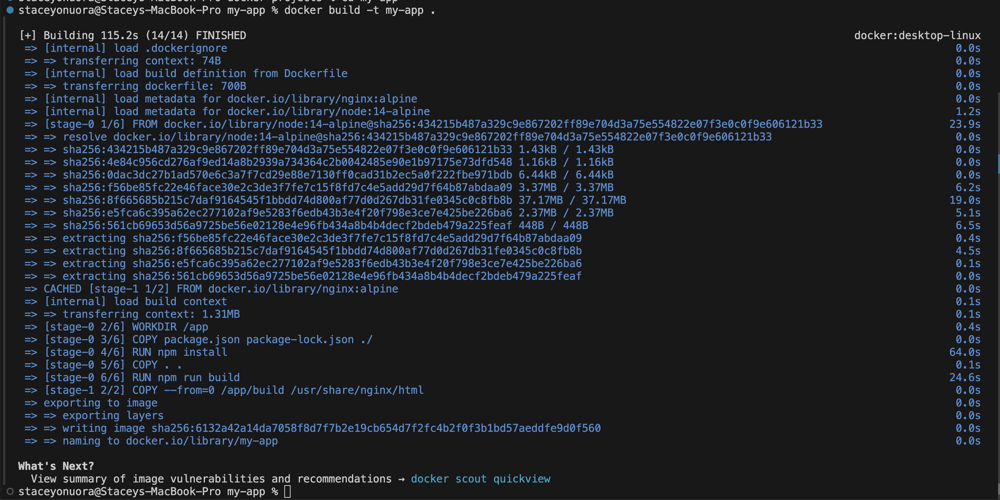

# Project - Containerization with Docker

## Tasks, Screenshots and Descriptions

### Project Research and Report: [see report here](./DOCKER-PROJECT-REPORT-BY-STACEY-AND-NEDU.pdf)

### Task 2: Understanding Docker and Container Basics
Docker Installation:

*Successful docker installation*

### Task 3: Hands-On Practical with Docker

#### Explore Docker Images, Containers, and Dockerfile:

*Dockerfile* 

*Build docker image* 

*Run container*

*Container ruuning on docker desktop*

*Application running*

Commands
- Command to build docker image - `docker build -t <image_name> .` 
- Command to run container image - `docker run -p <host_port>:<container_port> <image_name>`  

  

#### Creating and Managing Docker Containers:

*Managing docker container*

Commands
- Command to list all containers - `docker ps -a` 
- Command to start container - `docker start <container_id_or_name>`
- Command to stop container - `docker stop <container_id_or_name>`
- Command to remove container - `docker rm <container_id_or_name>`

### Task 4: Container Orchestration and Networking

#### Create a user-defined bridge network

*Create user-defined bridge network*

#### Run two containers on this network and demonstrate that they can communicate with each other

*Run two containers on this network*

Commands
- Command to create a user-defined bridge network - `docker network create <network_name>` 
- Command to run container on network - `docker run -d --name <container_name> --network <network_name> <image_name>`
- Command to use the alpine image and run the sleep 1000 command to keep the container running for 1000 seconds - `docker run -d --name <container_name> --network <network_name> alpine sleep 1000`
- Command to open a shell in a container- `docker exec -it <container_id_or_name> sh`
- Command to test reachability - `ping <container_name>`
- Command to list networks - `docker network ls`
- Command to inspect network - `docker network inspect <network_name>`
- Command to inspect container - `docker inspect --format='{{json .NetworkSettings.Networks}}' <container_name>`

  
### Task 5: Docker Networking and Storage

#### Explore Docker Networking

*Create custom network configuration*

*Inspect custom network*

*Open shell in container*

Commands
- Command to create custom network - `docker network create --driver bridge --subnet <subnet_ip> --gateway <gateway_ip> <network_name>` 
- Command to run container on network - `docker run -d --name <container_name> --network <network_name> --ip <container_ip> <image_name>`
- Command to use the alpine image and run the sleep 1000 command to keep the container running for 1000 seconds - `docker run -d --name <container_name> --network <network_name> --ip <container_ip> alpine sleep 1000`
- Command to open a shell in a container- `docker exec -it <container_id_or_name> sh`
- Command to test reachability - `ping <container_ip>`
- Command to list networks - `docker network ls`
- Command to inspect network - `docker network inspect <network_name>>`
- Command to inspect container - `docker inspect --format='{{json .NetworkSettings.Networks}}' <container_name>`

#### Persistent Storage Solutions

*Create container with mounted volume*

Commands
- Command to create docker volume - `docker volume create <volume_name>`
- Command to run container on network - ` docker run -d --name <container_name> --v <volume_name>:/data <image_name>`
- Command to use the alpine image and run the sleep 1000 command to keep the container running for 1000 seconds - `docker run -d --name <container_name> --v <volume_name>:/data alpine sh -c "while true; do sleep 1000; done"`
- Command to write data to volume - `docker exec -it <container_name> sh -c "echo 'Hello, Docker!' > /data/<file_name>.txt"`
- Command to stop container - `docker stop <container_name>`
- Command to remove container - `docker rm <container_name>`
- Command to open a shell in a container- `docker exec -it <container_id_or_name> sh`
- Command to check data in container - `docker exec -it <container_name> sh -c "cat /data/<file_name>.txt"`

